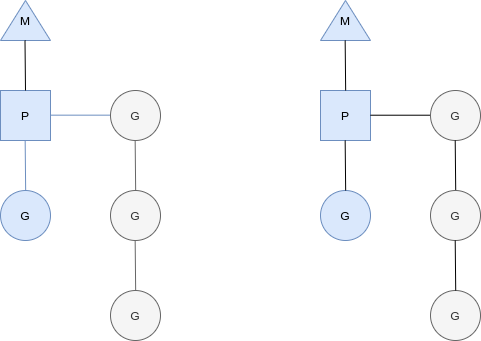
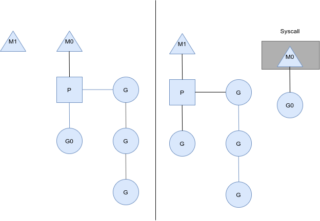
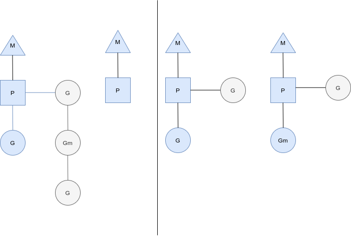

# goroutine

Go is a language supporting built-in concurrent programming. By using the `go` keyword to create goroutines (light weight threads) and by [using](https://go101.org/article/channel-use-cases.html) [channels](https://go101.org/article/channel.html) and [other concurrency](https://go101.org/article/concurrent-atomic-operation.html) [synchronization techniques](https://go101.org/article/concurrent-synchronization-more.html) provided in Go, concurrent programming becomes easy, flexible and enjoyable.


```go
func numbers()  {
	for i := 0; i < 10; i++ {
		time.Sleep(250 *time.Millisecond)
		fmt.Printf("%d ", i)
	}
}

func alphabet()  {
	for i := 'a'; i <= 'p' ; i++ {
		time.Sleep(500*time.Millisecond)
		fmt.Printf("%c ", i)
	}
}

func main()  {
	go numbers()
	go alphabet()
	time.Sleep(3*time.Second)
	fmt.Println("main terminated")
}
```

```0 1 a 2 3 b 4 5 c 6 7 d 8 e 9 main terminated```


### when the Goroutine is finished ?

the goroutine  function is finished , then the gorountine is finished.

the`main` functinon is finished to run, because the `gorouitne ` inside the `main` function is already finished.


### Goroutine Scheduling :

`GMP`  it is the implementation of the runtime level of the Go language, and is a set of scheduling system implemented by the Go language itself. Different from the operating system scheduling OS 

threads.


The triangle represents an OS thread. It's the thread of execution  managed by the OS and works pretty much like your standard POSIX thread.  In the runtime code, it's called **`M`**for machine.  

The circle represents a goroutine.    It includes the stack, the instruction pointer and other information important for scheduling goroutines, like any channel it might be  blocked on. In the runtime code, it's called a **`G`**.  

The rectangle represents a context for scheduling. You can look at  it as a localized version of the scheduler which runs Go code on a  single thread. It's the important part that lets us go from a N:1 scheduler to a  M:N scheduler.In the runtime code, it's called **``P``** for processor. More on this part in a bit.  





Here we see two Threads `M` , each holding  a context `P` , each running a goroutine `G`. In order to run goroutines , a thread must hold a context.

The number of context is set on startup to the value of the `GOMAXPROCS` environment variable or through the runtime function `GOMAXPROCS()` .We can use that to rune the invocation of `Go` process to individual computer, such at a 4 core PC is running GO code on 4 threads.


### Who you gonna (sys) call ?

You might wonder now, why have contexts at all ? Can not we just put the runqueues on the threads and get rid of contexts ? Not really. Then reason we have contexts is so that we can hand them off to other threads if the running thread needs to block for some reason.




Here we see a thread giving up it is context so that another thread can run it. The scheduler makes sure there are enough threads to run all contexts. `M1` in the illustration above might be created just for the purpose of handing this syscall or it could come from a thread cache. The syscalling thread will hold to the goroutine that made the syscall since it is technically still executing , although blocked in hte OS.

When the syscall returns, the thread must try and get a context in order to run the returning goroutine.     The normal mode of operation is to steal a context from one of the other threads.     If it can't steal one, it will put the goroutine on a global runqueue, put itself on the thread cache and go to sleep.  

The global runqueue is a runqueue that contexts pull from when they run out of their local runqueue.     Contexts also periodically check the global runqueue for goroutines.     Otherwise the goroutines on global runqueue could end up never running because of starvation.  

This handling of syscalls is why Go programs run with multiple threads, even when `GOMAXPROCS` is 1.     The runtime uses goroutines that call syscalls, leaving threads behind.  


### Stealing work

Another way that the supported  state of the system can change is when a  context runs out of goroutines to schedule to. This can happen if the amount of work on the contexts runqueues is  unbalanced. This can cause a context to end up exhausting it's runqueue while  there is still work to be done in the system.  To keep running Go code, a context can take goroutines out of the  global runqueue but if there are no goroutines in it, it'll have to get  them from somewhere else.




That somewhere is the other contexts. When a context runs out, it will  try to steal about half of the runqueue from another context. This makes sure there is always work to do on each of the contexts,  which in turn makes sure that all threads are working at their maximum  capacity.  


### math/rand

```go
func f()  {
   // that can help to print different random every time we run the code
   rand.Seed(time.Now().UnixNano()) 
   for i := 0; i < 5; i++ {
      r1 := rand.Int()
      r2 := rand.Intn(10)
      fmt.Println(r1, r2)
   }
}
```

### Sync.WaitGroup

in Go Concurrencey, it's easy to make by using `sync.WaitGroup`  for running `gorountine` .

```go
var wg sync.WaitGroup

func f1(i int)  {
   defer  wg.Done() 
   time.Sleep(time.Second * time.Duration(rand.Intn(3)))
   fmt.Println(i)
}

func main() {
   for i := 0; i < 10; i++ {
      wg.Add(1) // running one goroutine and add +1
      go f1(i)
   }

   wg.Wait() //waiting for all added goroutine finish
}
```

if we run this code many times , the order of number in output is also different. that is mean there are 10 `goroutines `  concurrently running .


### GOMAXPROCS

```go
var wg sync.WaitGroup

func a()  {
   defer wg.Done()
   for i := 0; i < 10; i++ {
      fmt.Printf("A:%d\n", i)
   }
}

func b()  {
   defer wg.Done()
   for i := 0; i < 10; i++ {
      fmt.Printf("B:%d\n", i)
   }
}

func main() {
   runtime.GOMAXPROCS(1)
   fmt.Println(runtime.NumCPU())
   wg.Add(2)
   go a()
   go b()
   wg.Wait()
}
```

`M:N`  share `M` goroutine to `N` OS.

### The relationship between Operating System Threads and Goroutines in Go:

- One operating system thread corresponds to multiple goroutines .
- Go programs can use multiple operating system threads at the same time
- There is a many-to-many relationship between goroutine and OS threads, that is `m:n`


# Channel

If `goroutine` is the concurrent execution body of Go program, `channel` is the connection between them. A `channel` is a communication mechanism that allows one goroutine to send a specific value to another `goroutine`.

`Channel` in Go language is a special type. The `channel` is like a conveyor belt or queue, always following the First In First Out (FIFO) rule to ensure the order of sending and receiving data. Each 	`channel` is a specific type of conduit, that is  when you declare the channel, you need to specify the element type for it.


```go
var b chan int //channel type format
```


```go
var b chan int

func main() {
    fmt.Println(b) // nil
    b = make(chan int) // you need to initialize the channel
    fmt.Println(b) // 0xc000094060
}
```


The declared `channel`needs to be initialized with the `make` function before it can be used.


## channel Operation:

`channel` has three Operations `send`, `receive` and `close`.

`<-`

1. send : `ch1 <- 1`
2. receive : `<- ch1`
3. close : `close(ch1)`


The thing to note about closing the channel is that the channel needs to be closed only when the receiver `goroutine` is notified that all the data has been sent. The channel can be recycled by the garbage collection mechanism. It is not the same as closing the file. It is necessary to close the file after the operation is completed, but it is not necessary to close the channel.


## What happens after closing a channel

1. after closing a channel and you need send to new a channel again , that can cause a  `panic`
2. Receiving a closed channel will keep getting the value until the channel is empty
3. Performing a receive operation on a channel that is closed and has no value will get the zero value of the corresponding type
4. already closed channel can not close again, that can cause a `panic`.

## take  value for Loop channel

After finished to send data to channel, we need to close the function by using `close`.

```go
var wg sync.WaitGroup

func f1(ch1 chan int)  {
   defer wg.Done()
   for i := 0; i < 100; i++ {
      ch1 <- i
   }
   close(ch1)
}

func f2(ch1, ch2 chan int)  {
   defer wg.Done()
   for {
      x, ok := <- ch1
      if !ok {
         break
      }
      ch2 <- x * x
   }
   close(ch2)
}

func main() {
   a := make(chan int, 50)
   b := make(chan int, 100)
   wg.Add(2)
   go f1(a)
   go f2(a, b)
   wg.Wait()
   for ret := range b {
      fmt.Println(ret)
   }
}
```


## One-Way-Only channel

Sometimes we pass the channel as a parameter between multiple task functions. Many times we use the channel in different task functions to restrict it, such as restricting the channel to only send or only receive in the function.

Then golang uses `one-way-only channel` to solve this problem. Here the example:

```go
func counter(out chan<- int) {
	for i := 0; i < 100; i++ {
		out <- i
	}
	close(out)
}

func squarer(out chan<- int, in <-chan int) {
	for i := range in {
		out <- i * i
	}
	close(out)
}

func printer(in <-chan int) {
	for i := range in {
		fmt.Println(i)
	}
}

func main() {
	ch1 := make(chan int)
	ch2 := make(chan int)
	go counter(ch1)
	go squarer(ch2, ch1)
	printer(ch2)
}
```
- `chan <- int` only send , can not receive.
- `<- chan int` only receive , can not send.

# work pool

We usually use the `worker pool` mode that can specify the number of goroutines to start to control the number of `goroutines` and prevent `goroutine` leak and crash.

```go
func worker(id int, jobs <-chan int, result chan<- int)  {
   for j := range jobs {
      fmt.Printf("Worker: %d start job: %d\n", id, j)
      time.Sleep(time.Second)
      fmt.Printf("Worker: %d end: %d\n", id, j)
      result <- j * 2
   }
}

func main() {
   jobs := make(chan int, 100)
   result := make(chan int, 100)

   //Run 3 goroutines
   for w := 1; w <= 3; w++ {
      go worker(w, jobs, result)
   }

   // giving 5 works
   for j := 1; j <= 5; j++ {
      jobs <- j
   }
   close(jobs)

   //receive the given work
   for r := 1; r <=5 ; r++ {
      <-  result
   }
}
```

# for-select loop

loop runs in its own goroutine. `select` lets avoid blocking indefinitely in one one state.

```go
select{
    case <-ch1:
        ...
    case data := <-ch2:
        ...
    case ch3<-data:
        ...
    default:
        ...
}
```


Here an example for `select`:

```go
func main() {
   ch := make(chan int, 1)
   for i := 0; i < 10; i++ {
      select {
      case x := <- ch :
         fmt.Println(x)
      case ch <-i :
      }
   }
}
```

Use  `select` statement help to improve the readability of the code:

- `select`  can handle the sending/receiving operations of one or more `channel`
- If there are multiple  `case` running at the same time, `select` will randomly select one
- For `select{}` without any `case`, it will wait forever and can be used to block the main function.


 


